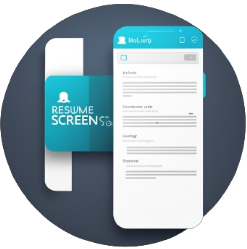

  

<h1 align="center">
  Resume Screening App
</h1>

<h3 align="center">
  Web Application
</h3>

  

The "Resume Screening App" is a Python application developed using the Streamlit library, designed to streamline the process of categorizing resumes based on their content. Upon launching the app, users are presented with a user-friendly interface where they can upload their resume in either PDF or text format. The application leverages various natural language processing (NLP) techniques and libraries, such as NLTK (Natural Language Toolkit) or spaCy, to extract and analyze the textual information from the provided resume. It employs techniques like tokenization, part-of-speech tagging, and named entity recognition to comprehend the resume's content.
 
Once the user uploads their resume, the system performs an automated analysis of the text, extracting key information such as skills, work experience, education details, and other relevant attributes. The extracted information is then processed through a classification model or rules-based system trained on predefined categories (e.g., IT, Marketing, Finance, etc.). Using this analysis, the system assigns the resume to a specific category or multiple categories, indicating the professional field or specialization the user might belong to. The user is presented with the result on the app interface, displaying the category or categories identified based on the content of their resume.
 
The system provides an efficient way for users, such as recruiters or job seekers, to quickly ascertain which professional domain their resume aligns with, aiding in better categorization, matching, or filtering of resumes based on specific job requirements or career paths. This application showcases the integration of Python, Streamlit, and NLP techniques to automate the resume screening process, offering users a convenient and time-saving solution for categorizing resumes based on their content.

  
<!-- ................................................................................................................................. -->

### Features
 
Following are some of the new features and learning encountered while creating this amazing project:

- File Upload:  Users can easily upload their resume files in either PDF or text format through a user-friendly interface.
- Text Extraction:  The app uses libraries or tools like PyPDF2 or Textract to extract text from PDF files, enabling the system to analyze the content.
- NLP Analysis:  Leveraging NLP techniques, the app performs in-depth analysis of the resume text to extract relevant information such as skills, work experience, education, certifications, etc.
- Data Preprocessing:  The extracted text undergoes preprocessing steps like tokenization, cleaning, and normalization to enhance accuracy in content analysis.
- Category Prediction:  Utilizing classification models or rule-based systems, the app categorizes the resume into specific professional domains or job categories (e.g., IT, Marketing, Finance) based on the extracted information.
- Interactive UI:  A user-friendly interface built with Streamlit that displays the uploaded resume, analysis progress, and the identified categories or results.
- Category Display:  After analysis, the app displays the predicted category or categories the resume aligns with, aiding users in understanding the job domain their qualifications match.
- Feedback Mechanism:  Incorporating a feature where users can provide feedback on the accuracy of the categorization, helping to improve the app's performance over time.
- Export/Download Results:  Users can download or export the analyzed results, such as a summary of extracted information or the categorized resume, for their reference or further use.
- Error Handling:  Implementation of error handling mechanisms to guide users in case of invalid file uploads or errors during the analysis process.
- Customization and Extension:  Provision for customization, allowing users to add new categories, update the classification model, or incorporate new features as needed.

  
<!-- ................................................................................................................................. -->

### Demo

  The Demo of this working project can be found on  
  

  
<!-- ................................................................................................................................. -->

### GUI

  
<!-- ................................................................................................................................. -->

### Technology Stack
 
Follwing technologies have been used at the core of this application to make it stand in the market place:

- Python
- Streamlit
- Kaggle

  
<!-- ................................................................................................................................. -->

### Advancement

> No Advancement Needed

  
<!-- ................................................................................................................................. -->

### Deployment Details

The website is deployed using the free hosting provided by **Vercel**

  

  
Later on the link was customized using the well-known URL shortener and customizer **Rebrandly**:  

  

  
<!-- ................................................................................................................................. -->

### Developer

Muhammad Abdullah Butt  
abdullahbutt12292210@gmail.com  
> [Instagram](https://www.instagram.com/abdullah.butt.22/) 
> [FaceBook](https://www.facebook.com/profile.php?id=100076291614529) 
> [YouTube](https://www.youtube.com/channel/UCnuOFQyMywg-KuoN-lmav1Q) 
> [Portfolio](https://rebrand.ly/MuhammadAbdullahButt_MABCORP) 
> [Project Displayer]( https://rebrand.ly/ProjectDisplayer_MABCORP)
  
<!-- ................................................................................................................................. -->

